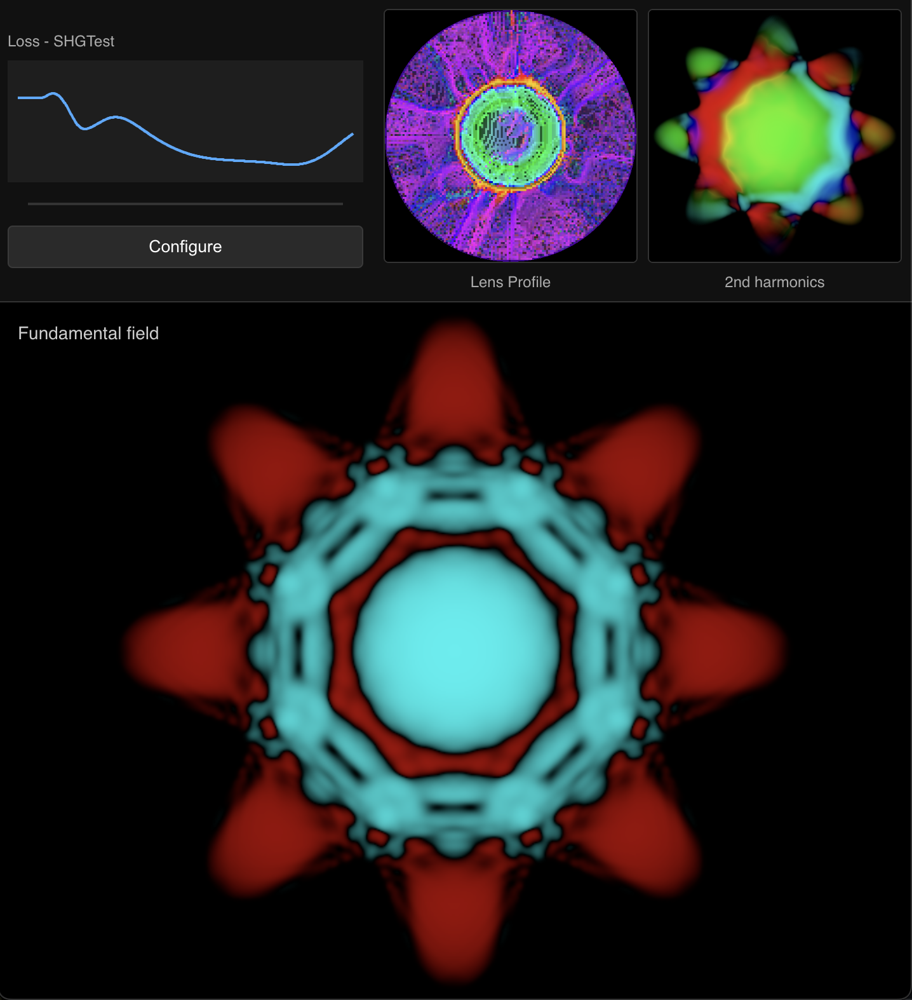
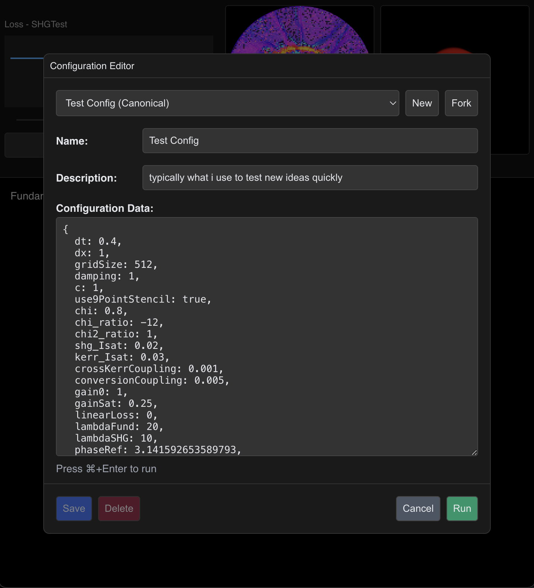

# Nonlinear Optics Sandbox

An interactive study of controlled nonlinear dynamics, implemented through the concrete example of coupled optical fields. Similar to how a simple pendulum provides insight into oscillatory systems, this project uses a specific optical configuration—coupled fundamental/harmonic fields interacting with an adaptive medium—as an idealized model for exploring how optimization processes can guide complex nonlinear systems toward desired states.

The app combines:

- Real-time visualization of coupled field evolution
- GPU-accelerated physics with nonlinear optical effects (e.g. Kerr, χ(2), birefringence—more details below)
- Gradient-based optimization of spatially-varying control parameters

While implemented using nonlinear optics, the underlying patterns of parameter-guided nonlinear dynamics may offer insights relevant to other complex systems.

At its core is a sophisticated real-time nonlinear optics simulator (contained in `simulation.js`) which could be adapted for use in other projects.

Visit the live demo: https://westoncb.github.io/nonlinear-optics-sandbox/

<div align="center">
  
  
</div>

## Table of Contents

- [Quick Start](#quick-start)
- [Project Overview](#project-overview)
- [Key Components](#key-components)
  - [Nonlinear Wave Simulator](#nonlinear-wave-simulator)
    - [Field Initialization](#field-initialization)
    - [Spatial Derivatives](#spatial-derivatives)
    - [Local Refractive Index & Nonlinearities](#local-refractive-index--nonlinearities)
    - [Second-Harmonic Generation (SHG)](#second-harmonic-generation-shg)
    - [Time Integration & Gain](#time-integration--gain)
    - [Boundary Damping & Fresnel Reflection](#boundary-damping--fresnel-reflection)
    - [Pulse Injection](#pulse-injection)
  - [Adaptive Lens Optimization](#adaptive-lens-optimization)
  - [Configuration & UI](#configuration--ui)

## Quick Start

```bash
git clone https://github.com/westoncb/nonlinear-optics-sandbox.git
cd nonlinear-optics-sandbox
npm install
npm run dev
```

---

## Project Overview

This project explores the control of nonlinear dynamics through a concrete implementation in optics. The heart of the system is a real-time simulation of two coupled optical fields (fundamental and second-harmonic) interacting with an adaptive optical medium whose properties are continuously adjusted by an optimization process. The simulation takes place within a configurable reflective cavity with detailed boundary modeling.

Key aspects of the implementation:

1. **Physical Simulation**: The simulation implements a rich set of nonlinear optical effects (Kerr, χ(2), birefringence, etc.) while maintaining real-time performance. This creates a complex yet controllable dynamical system with multiple competing nonlinear processes.

2. **Optimization Framework**: An ADAM optimizer continuously updates the spatial distribution of optical properties (refractive index, nonlinearities) based on observed field characteristics. This creates a feedback loop between the nonlinear dynamics and the controlling medium.

3. **Visualization**: The interface provides three synchronized views:
   - The fundamental field evolution
   - The second-harmonic field evolution
   - The spatial distribution of optical properties, updating in real-time as the optimizer explores the parameter space

While second-harmonic generation was chosen as the coupling mechanism between fields, the framework could be adapted for other nonlinear interactions (e.g., four-wave mixing). The essential pattern—optimization attempting to guide coupled nonlinear fields through parameter adjustment—remains the same.

---

## Key Components

### Nonlinear Wave Simulator

_Location: `simulation.js`_

This simulator evolves two envelope fields (fundamental and SHG) via a leapfrog-like scheme, accounting for both linear and nonlinear processes at each pixel. Below is a high-level breakdown:

#### Field Initialization

- **Two RGBA textures** are allocated:
  - One stores the fundamental field as [Re, Im, phase match, δn]
  - One stores the SHG field in the same format, where Re/Im are the complex field components and δn is the nonlinear index change
- The fundamental field typically starts as a **Gaussian beam** plus random thermal noise, while the SHG field starts near zero but also includes a small noisy "seed."
- A **user-defined gain mask** can be applied to simulate an active medium, with saturable gain and linear loss modulated per pixel.

#### Spatial Derivatives

- A fourth-order accurate **9-point** Laplacian is used to approximate $\nabla^2 E$

#### Local Refractive Index & Nonlinearities

- Each pixel corresponds to an entry in a "lens" texture, which provides:
  - **Base refractive index** with support for angle-dependent indices in birefringent regions
  - **Dispersion coefficients** that shift the local index with wavelength
  - **$\chi^{(2)}$ (second-harmonic)** and **$\chi^{(3)}$ (Kerr)** nonlinearity strengths
- **Kerr effects**: The effective index includes multiple contributions:
  - Self-phase modulation via $\chi^{(3)} I$ with saturation
  - Cross-Kerr coupling between fundamental and SHG fields
  - Both effects include saturation to prevent unphysical index changes
- **Birefringence & Phase-Matching**:
  - Full angle-dependent $n_o/n_e$ calculations for arbitrary crystal orientations
  - Automatic calculation of local phase mismatch $\Delta k$ based on geometry and material properties
  - Support for temperature-dependent phase matching (through index temperature coefficients)

#### Second-Harmonic Generation (SHG)

- **Up-conversion** from fundamental to SHG and **down-conversion** from SHG to fundamental occur simultaneously, with saturable conversion coefficients that limit exponential growth.
- The local **phase mismatch** factor $\Delta k$ (computed from local indices and geometry) enforces or impedes conversion efficiency.

#### Time Integration & Gain

- We use a **leapfrog-like** time stepping:

$$
E^{n+1} = 2\,E^{n} - E^{n-1} + \left[\text{laplacian} + \text{nonlinear terms} + \text{gain}\right]\Delta t^2
$$

- Each pixel experiences **saturable gain** (and linear loss) according to the local gain mask, preventing unbounded amplification.

#### Boundary Damping & Fresnel Reflection

- The cavity boundary supports arbitrary shapes through a modulated radius: $R(\theta) = R_0(1 + \alpha\cos(m\theta))$
- A **smooth damping region** outside the modulated boundary helps avoid spurious reflections
- **Fresnel reflection** is computed with:
  - Separate TE/TM polarization handling
  - Angle-dependent reflection coefficients
  - Gradual transition region to avoid discontinuities
  - Proper handling of total internal reflection conditions

#### Pulse Injection

- Additional pulses can be **periodically injected** into the fundamental field, re-seeding the cavity. This is useful for driving repeated or pulsed interactions.

---

### Adaptive Lens Optimization

_Location: `lens-optimizer.js`, `update-strategies.js`_

This component adjusts the spatial distribution of lens parameters (base index, dispersion, $\chi^{(2)}$, $\chi^{(3)}$) to optimize nonlinear processes. It works by:

1. **Accumulating Field Data**
   After each simulation step, the fundamental and SHG field arrays (stored in RGBA textures) are read back. By examining each pixel's real and imaginary values—and auxiliary metrics placed in extra channels—the optimizer aggregates data into **radial zones** and **angular sectors**. This matches the polar "lens" discretization used in the simulation.

2. **Computing Metrics & Gradients**

   - A variety of metrics (e.g., amplitude, phase gradients, phase mismatch) are summed for each zone/sector.
   - A chosen "update strategy" (in `update-strategies.js`) computes partial derivatives (gradients) w.r.t. the lens parameters (`baseIndex`, `dispersion`, $\chi^{(2)}$, $\chi^{(3)}$) based on a target objective (e.g., maximizing SHG output or improving phase matching).

3. **Applying ADAM Optimizer**
   - The lens parameters are updated using the popular **ADAM** method with bias-corrected first and second moments, a configurable learning rate, and an $\epsilon$ parameter for numerical stability.

---

### Configuration & UI

_Location: `config-manager.js`, `components/*`_

Provides:

- Parameter adjustment/selection through an interactive editor
- Persistent storage of simulation configurations
- Visualization of field amplitudes, phases, and lens structure
- Progress monitoring of optimization metrics

The UI supports expanding any visualization to full-screen, offers real-time feedback on the optimization process, and allows tuning of simulation parameters (e.g., boundary shape, lens nonlinearity, gain) through the config editor.
